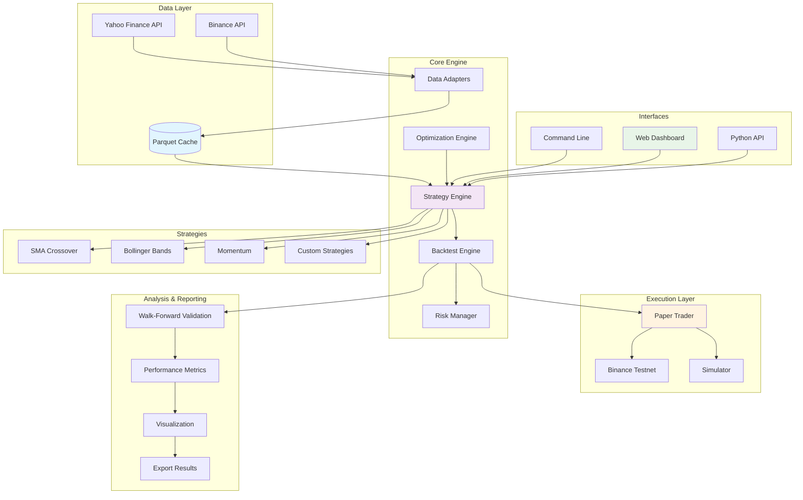

# 🏛️ Athena Trading Platform

> Production-grade algorithmic trading platform with backtesting, optimization, and live trading capabilities

[](https://github.com/your-username/athena/actions)
[](https://www.python.org/downloads/)
[](https://python-poetry.org/)
[](https://github.com/astral-sh/ruff)
[](http://mypy-lang.org/)
[](https://pytest.org/)
[](https://github.com/PyCQA/bandit)
[](https://www.docker.com/)
[](https://opensource.org/licenses/MIT)

## 📋 Table of Contents

- [Features](#features)
- [Architecture](#architecture)
- [Quick Start](#quick-start)
- [Dashboard](#dashboard)
- [Docker Setup](#docker-setup)
- [Installation](#installation)
- [Usage](#usage)
- [Examples](#examples)
- [Development](#development)
- [Testing](#testing)
- [Configuration](#configuration)
- [Security](#security)
- [Contributing](#contributing)
- [Roadmap](#roadmap)

## ✨ Features

- **📊 Data Ingestion**: Yahoo Finance integration with local Parquet caching
- **📈 Strategies**: Modular strategy framework (SMA Crossover, Bollinger Bands, Momentum)
- **⚡ Backtesting**: Vectorized backtesting engine with comprehensive metrics
- **🔄 Walk-Forward Validation**: Robust out-of-sample testing with rolling windows
- **🎯 Optimization**: Bayesian hyperparameter optimization with Optuna
- **💰 Risk Management**: Enhanced position sizing with Kelly Criterion and exposure limits
- **📝 Paper Trading**: Binance testnet integration with auto-fallback to simulator
- **🌐 Dashboard**: Interactive web dashboard with real-time backtesting and visualization
- **🐳 Docker Ready**: Full containerization with docker-compose orchestration
- **🔧 CLI**: Comprehensive command-line interface with Typer
- **🚀 CI/CD**: Complete GitHub Actions pipeline with security scanning
- **🔒 Security**: Built-in security best practices and vulnerability scanning

## 🏗️ Architecture



### System Components

```
athena/
├── core/              # Core utilities and configurations
│   ├── config.py      # Environment and settings management
│   ├── logging.py     # Structured logging with rich formatting
│   ├── types.py       # Data models and type definitions
│   ├── position.py    # Position sizing and risk management
│   └── metrics.py     # Performance calculation utilities
├── data/              # Data providers and caching
│   ├── yahoo.py       # Yahoo Finance adapter with caching
│   └── base.py        # Base data provider interface
├── strategies/        # Trading strategy implementations
│   ├── base.py        # Abstract strategy base class
│   ├── sma_crossover.py    # Simple Moving Average crossover
│   ├── bollinger_bands.py  # Bollinger Bands mean reversion
│   └── momentum.py    # RSI + MACD momentum strategy
├── backtest/          # Backtesting infrastructure
│   ├── engine.py      # Core backtesting engine
│   ├── walk_forward.py     # Walk-forward validation
│   └── metrics.py     # Performance metrics calculation
├── optimize/          # Parameter optimization
│   ├── optimizer.py   # Optuna-based hyperparameter tuning
│   └── objectives.py  # Optimization objective functions
├── live/              # Live and paper trading
│   ├── broker.py      # Abstract broker interface + simulator
│   ├── binance_testnet.py  # Binance testnet integration
│   └── paper_trader.py     # Paper trading engine
├── dashboard/         # Web dashboard
│   └── app.py         # Dash/Plotly interactive dashboard
└── cli/               # Command-line interface
    └── main.py        # Typer-based CLI commands
```

## 🚀 Quick Start

```bash
# Clone the repository
git clone https://github.com/yourusername/athena.git
cd athena

# Install Poetry (if not installed)
pip3 install poetry

# Setup the project
make setup

# Run a demo backtest
make backtest-demo

# Or use the CLI directly
poetry run athena backtest SPY --start 2020-01-01 --end 2024-01-01 --strategy sma
```

## 🌐 Dashboard

Launch the interactive web dashboard for visual backtesting and analysis:

```bash
# Start the dashboard
make dashboard

# Or directly
poetry run python -m athena.dashboard.app
```

Visit `http://localhost:8050` to access the dashboard featuring:

- **📊 Interactive Controls**: Select symbols, strategies, date ranges, and parameters
- **📈 Real-time Backtesting**: Run backtests directly from the web interface
- **📉 Rich Visualizations**: Equity curves, drawdowns, rolling Sharpe, returns distributions
- **📋 Performance Metrics**: Comprehensive metrics table with key statistics
- **🎯 Parameter Optimization**: Built-in hyperparameter tuning with heatmaps
- **🔄 Walk-Forward Validation**: Out-of-sample testing with split analysis
- **💾 Export Capabilities**: Download results as CSV and PNG files
- **⚡ Async Processing**: Non-blocking UI with progress indicators

### Demo Results (SPY 2018-2024)

| Strategy | Total Return | Sharpe Ratio | Max Drawdown | Trades | Win Rate | Profit Factor |
|----------|-------------|--------------|--------------|--------|----------|---------------|
| **Bollinger Bands** | **94.97%** | **0.84** | -33.72% | 19 | 63.16% | 5.18 |
| SMA Crossover | 49.93% | 0.65 | -30.30% | 15 | 60.00% | 2.22 |
| Momentum | 9.38% | 0.32 | -16.12% | 1 | 100.00% | 0.00 |

*Best performing strategy: Bollinger Bands with 14.85% annualized return*

### Dashboard Features

| Feature | Description |
|---------|-------------|
| **Strategy Selection** | Choose from SMA, Bollinger Bands, or Momentum strategies |
| **Parameter Tuning** | Adjust strategy parameters with dynamic controls |
| **Risk Management** | Configure position sizing (Fixed Fraction, Kelly, Capped Kelly) |
| **Date Range Selection** | Flexible date picker for custom backtest periods |
| **Real-time Results** | See results update instantly with loading indicators |
| **Performance Analytics** | Sharpe ratio, max drawdown, win rate, profit factor, and more |
| **Trade Analysis** | Detailed trade-by-trade breakdown with export capability |
| **Optimization Tools** | Parameter optimization with leaderboard and heatmaps |
| **Validation Suite** | Walk-forward analysis with in-sample vs out-of-sample metrics |

## 🐳 Docker Setup

### Quick Start with Docker

```bash
# Start the dashboard with Docker Compose
docker compose up --build -d

# View logs
docker compose logs -f dashboard

# Stop services
docker compose down
```

Visit `http://localhost:8050` for the dashboard.

### Docker Services

| Service | Purpose | Ports |
|---------|---------|-------|
| **dashboard** | Web dashboard for interactive analysis | 8050 |
| **cli** | CLI container for batch operations | - |

### Using CLI Container

```bash
# Run backtest in container
docker compose run cli poetry run python -m athena.cli.main backtest SPY --strategy sma

# Run optimization
docker compose run cli poetry run python -m athena.cli.main optimize AAPL --trials 50

# Access container shell
docker compose run cli bash
```

### Volume Mounts

- `./data_cache:/app/data_cache` - Persistent data cache
- `./artifacts:/app/artifacts` - Optimization results and exports
- `./dashboard_cache:/app/dashboard_cache` - Dashboard result cache
- `./logs:/app/logs` - Application logs
- `./.env:/app/.env:ro` - Environment configuration (read-only)

### Production Deployment

```bash
# Build production images
docker build -f docker/Dockerfile.dashboard -t athena-dashboard:latest .
docker build -f docker/Dockerfile.app -t athena-app:latest .

# Run with production settings
docker run -d \
  --name athena-dashboard \
  -p 8050:8050 \
  -v $(pwd)/data_cache:/app/data_cache \
  -v $(pwd)/artifacts:/app/artifacts \
  --env-file .env \
  athena-dashboard:latest
```

## 📦 Installation

### Prerequisites

- Python 3.11+
- Poetry package manager
- Git

### Detailed Installation

1. **Install Poetry**:
```bash
pip3 install poetry
```

2. **Clone and setup**:
```bash
git clone https://github.com/yourusername/athena.git
cd athena
poetry install
```

3. **Configure environment**:
```bash
cp .env.example .env
# Edit .env with your configuration
```

4. **Install pre-commit hooks**:
```bash
poetry run pre-commit install
```

## 🎮 Usage

### CLI Commands

#### Backtest a strategy
```bash
athena backtest SPY \
    --start 2020-01-01 \
    --end 2024-01-01 \
    --strategy sma \
    --fast-period 20 \
    --slow-period 50
```

#### Download historical data
```bash
athena ingest "SPY,QQQ,IWM" \
    --start 2020-01-01 \
    --end 2024-01-01
```

#### Optimize strategy parameters
```bash
athena optimize AAPL \
    --strategy sma \
    --trials 50 \
    --start 2020-01-01 \
    --end 2023-12-31
```

#### Walk-forward validation
```bash
athena wfv SPY \
    --train 730 \
    --test 180 \
    --strategy bollinger
```

#### Paper trading
```bash
# With Binance testnet (requires API keys)
athena paper BTCUSDT \
    --strategy momentum \
    --capital 10000 \
    --testnet true

# Simulator fallback (no keys needed)
athena paper AAPL \
    --strategy sma \
    --capital 50000 \
    --testnet false
```

#### Launch dashboard
```bash
athena dashboard --port 8050
```

#### Manage cache
```bash
# View cache info
athena cache info

# Clear all cache
athena cache clear

# Clear specific symbol
athena cache clear-symbol --symbol SPY
```

### Python API

```python
from athena.data.yahoo import YahooDataAdapter
from athena.strategies.sma_crossover import SMACrossoverStrategy
from athena.backtest.engine import BacktestEngine

# Fetch data
adapter = YahooDataAdapter()
data = adapter.fetch("SPY", "2020-01-01", "2024-01-01")

# Initialize strategy
strategy = SMACrossoverStrategy(fast_period=20, slow_period=50)

# Run backtest
engine = BacktestEngine(initial_capital=100000)
result = engine.run(strategy, data, "SPY")

# Print metrics
print(f"Total Return: {result.total_return:.2%}")
print(f"Sharpe Ratio: {result.sharpe_ratio:.2f}")
print(f"Max Drawdown: {result.max_drawdown:.2%}")
```

## 💡 Examples

### Example 1: Simple Backtest

```python
from athena.data.yahoo import YahooDataAdapter
from athena.strategies.sma_crossover import SMACrossoverStrategy
from athena.backtest.engine import BacktestEngine

# Download data
adapter = YahooDataAdapter()
data = adapter.fetch("AAPL", "2023-01-01", "2023-12-31")

# Create strategy
strategy = SMACrossoverStrategy(fast_period=20, slow_period=50)

# Run backtest
engine = BacktestEngine(initial_capital=100000, commission=0.001)
result = engine.run(strategy, data, "AAPL")

print(f"📈 Total Return: {result.total_return:.2%}")
print(f"📊 Sharpe Ratio: {result.sharpe_ratio:.2f}")
print(f"📉 Max Drawdown: {result.max_drawdown:.2%}")
print(f"🎯 Win Rate: {result.win_rate:.2%}")
print(f"💰 Final Capital: ${result.final_capital:,.2f}")
```

### Example 2: Parameter Optimization

```python
from athena.optimize.optimizer import StrategyOptimizer, get_param_space
from athena.strategies.bollinger_bands import BollingerBandsStrategy

# Set up optimizer
optimizer = StrategyOptimizer()
param_space = get_param_space("bollinger")

# Run optimization
results = optimizer.optimize(
    strategy_class=BollingerBandsStrategy,
    data=data,
    symbol="AAPL",
    param_space=param_space,
    n_trials=100,
    timeout=300  # 5 minutes
)

print(f"🎯 Best Parameters: {results['best_params']}")
print(f"📊 Best Sharpe: {results['best_sharpe']:.3f}")
print(f"📈 Best Return: {results['best_return']:.2%}")

# Save results
optimizer.save_results(results)
```

### Example 3: Walk-Forward Validation

```python
from athena.backtest.walk_forward import WalkForwardValidator

# Set up walk-forward validation
validator = WalkForwardValidator(
    train_period_days=365,  # 1 year training
    test_period_days=90,    # 3 months testing
    step_days=30           # 1 month steps
)

# Run validation
result = validator.run(strategy, data, "AAPL")

print(f"📊 Average Sharpe: {result.avg_sharpe:.3f}")
print(f"📈 Average Return: {result.avg_return:.2%}")
print(f"📉 Average Max DD: {result.avg_max_dd:.2%}")
print(f"🔄 Number of Windows: {len(result.windows)}")

# Export results
files = validator.export_results(result, output_dir="./wfv_results")
print(f"📁 Results exported to: {files}")
```

### Example 4: Paper Trading

```python
from athena.live.paper_trader import PaperTradingEngine
from athena.strategies.momentum import MomentumStrategy

# Create paper trading engine
strategy = MomentumStrategy(rsi_period=14, macd_fast=12, macd_slow=26)
engine = PaperTradingEngine.create_with_auto_broker(
    strategy=strategy,
    symbol="BTCUSDT",
    initial_capital=10000
)

# Set up callbacks
def on_trade(trade):
    print(f"🔄 Trade executed: {trade.side} {trade.quantity} @ ${trade.entry_price:.2f}")

def on_signal(signal):
    print(f"📡 Signal: {signal.action} - Confidence: {signal.confidence:.2f}")

engine.set_callbacks(on_trade=on_trade, on_signal=on_signal)

# Start paper trading (this would run continuously)
# engine.start()  # Uncomment for live execution
```

### Example 5: Custom Strategy

```python
from athena.strategies.base import BaseStrategy
import pandas as pd
import numpy as np

class RSIStrategy(BaseStrategy):
    def __init__(self, rsi_period: int = 14, oversold: float = 30, overbought: float = 70):
        super().__init__("RSI_Strategy")
        self.rsi_period = rsi_period
        self.oversold = oversold
        self.overbought = overbought

    def generate_signals(self, data: pd.DataFrame) -> pd.DataFrame:
        # Calculate RSI
        delta = data['close'].diff()
        gain = (delta.where(delta > 0, 0)).rolling(window=self.rsi_period).mean()
        loss = (-delta.where(delta < 0, 0)).rolling(window=self.rsi_period).mean()
        rs = gain / loss
        rsi = 100 - (100 / (1 + rs))

        # Generate signals
        signals = pd.DataFrame(index=data.index)
        signals['signal'] = 0
        signals.loc[rsi < self.oversold, 'signal'] = 1   # Buy
        signals.loc[rsi > self.overbought, 'signal'] = -1  # Sell

        return signals

# Use the custom strategy
custom_strategy = RSIStrategy(rsi_period=21, oversold=25, overbought=75)
result = engine.run(custom_strategy, data, "AAPL")
```

## 🛠️ Development

### Makefile Commands

```bash
make help           # Show all available commands
make setup          # Complete project setup
make test           # Run tests with coverage
make lint           # Run linting (ruff + mypy)
make format         # Format code (black + isort)
make clean          # Clean cache and build files
make backtest-demo  # Run demo backtest
```

### Project Structure

```
.
├── athena/                 # Main package
│   ├── core/              # Core utilities
│   │   ├── config.py      # Configuration management
│   │   ├── logging.py     # Logging setup
│   │   ├── types.py       # Data types and models
│   │   └── risk.py        # Risk management
│   ├── data/              # Data adapters
│   │   └── yahoo.py       # Yahoo Finance adapter
│   ├── strategies/        # Trading strategies
│   │   ├── base.py        # Base strategy class
│   │   └── sma_crossover.py  # SMA crossover strategy
│   ├── backtest/          # Backtesting
│   │   ├── engine.py      # Backtest engine
│   │   └── metrics.py     # Performance metrics
│   └── cli/               # CLI interface
│       └── main.py        # CLI commands
├── tests/                 # Test suite
├── docker/                # Docker configurations
├── .github/workflows/     # GitHub Actions CI/CD
├── Makefile              # Development commands
├── pyproject.toml        # Poetry configuration
└── README.md             # This file
```

## 🧪 Testing

```bash
# Run all tests
make test

# Run specific test file
poetry run pytest tests/test_strategies.py

# Run with coverage
poetry run pytest --cov=athena --cov-report=html

# Run tests in watch mode
poetry run pytest-watch
```

## ⚙️ Configuration

Configuration is managed through environment variables and `.env` file:

```env
# Environment
ENV=development
LOG_LEVEL=INFO

# Data settings
DATA_DIR=./data_cache
CACHE_ENABLED=true

# Backtest settings
DEFAULT_INITIAL_CAPITAL=100000
DEFAULT_COMMISSION=0.001

# Risk management
MAX_POSITION_SIZE=0.2
KELLY_FRACTION=0.25
MAX_GROSS_EXPOSURE=1.0
PER_TRADE_RISK_CAP=0.02

# Paper trading (Binance testnet)
BINANCE_TESTNET_API_KEY=your_testnet_api_key_here
BINANCE_TESTNET_SECRET_KEY=your_testnet_secret_key_here
```

### 🔑 Binance Testnet Setup

For paper trading with real market data:

1. **Visit Binance Testnet**: Go to [https://testnet.binance.vision/](https://testnet.binance.vision/)
2. **Create Account**: Sign up for a free testnet account
3. **Generate API Keys**:
   - Go to API Management
   - Create a new API key
   - Enable "Enable Trading" permission
   - Note down your API Key and Secret Key

4. **Configure Athena**:
```bash
# Copy environment file
cp .env.example .env

# Edit .env file with your keys
BINANCE_TESTNET_API_KEY=your_actual_api_key_here
BINANCE_TESTNET_SECRET_KEY=your_actual_secret_key_here
```

5. **Test Connection**:
```bash
# Test paper trading (will auto-fallback to simulator if keys invalid)
athena paper BTCUSDT --strategy sma --capital 10000
```

**Note**: If you don't have Binance testnet keys, Athena will automatically fall back to the built-in simulator.

## 🔒 Security

Athena prioritizes security in financial applications. Key security features include:

### 🛡️ Built-in Security Features

- **🔐 No Credential Storage**: API keys never stored in application code
- **🌐 HTTPS/WSS Only**: All external communications encrypted
- **📝 Input Validation**: All user inputs validated and sanitized
- **🚫 Read-only by Default**: Most operations are read-only
- **🔍 Vulnerability Scanning**: Automated security scanning in CI/CD

### 📋 Security Best Practices

```bash
# Use environment variables for sensitive data
export BINANCE_API_KEY="your_api_key_here"
export BINANCE_SECRET_KEY="your_secret_key_here"

# Never commit .env files
echo ".env" >> .gitignore

# Use testnet for development
athena paper BTCUSDT --testnet true

# Regular security audits
poetry run safety check
poetry run bandit -r athena/
```

### 🚨 Security Considerations

| Risk Area | Mitigation |
|-----------|------------|
| **API Key Exposure** | Environment variables, no logging of credentials |
| **Network Security** | HTTPS/WSS, certificate validation, timeouts |
| **Input Validation** | Parameter validation, type checking, sanitization |
| **Dependency Security** | Regular updates, vulnerability scanning |
| **Trading Risk** | Testnet by default, position limits, risk controls |

### 📞 Reporting Security Issues

Please report security vulnerabilities responsibly:

1. **DO NOT** create public GitHub issues for security vulnerabilities
2. Email security issues to: `security@athena-trading.com`
3. Include detailed reproduction steps and impact assessment
4. Allow time for coordinated disclosure

See [SECURITY.md](SECURITY.md) for complete security policy.

## 🤝 Contributing

We welcome contributions! Please see our [Contributing Guide](CONTRIBUTING.md) for details.

### 🚀 Quick Contribution Guide

1. **Fork and Clone**
   ```bash
   git clone https://github.com/your-username/athena.git
   cd athena
   ```

2. **Set Up Development Environment**
   ```bash
   make setup
   poetry run pre-commit install
   ```

3. **Create Feature Branch**
   ```bash
   git checkout -b feature/your-feature-name
   ```

4. **Make Changes and Test**
   ```bash
   make test
   make lint
   ```

5. **Submit Pull Request**
   - Clear description of changes
   - All tests passing
   - Documentation updated

### 👥 Development Workflow

- **Code Style**: Ruff for linting and formatting
- **Type Checking**: MyPy for static type analysis
- **Testing**: Pytest with coverage reporting
- **CI/CD**: GitHub Actions with comprehensive checks
- **Security**: Automated vulnerability scanning

### 🏆 Recognition

Contributors are recognized in:
- Repository contributors section
- Release notes for major features
- CHANGELOG.md for notable contributions

## 🗺️ Roadmap

### Phase 1: Core Infrastructure ✅ COMPLETED
- [x] Core infrastructure and configuration management
- [x] Yahoo Finance data adapter with caching
- [x] Multiple trading strategies (SMA, Bollinger Bands, Momentum)
- [x] Vectorized backtesting engine with comprehensive metrics
- [x] CLI interface with Typer
- [x] Comprehensive testing framework

### Phase 2: Advanced Analytics ✅ COMPLETED
- [x] Additional strategies (Bollinger Bands, Momentum)
- [x] Optuna integration for Bayesian optimization
- [x] Walk-forward validation with rolling windows
- [x] Enhanced risk management and position sizing
- [x] Performance metrics and analytics

### Phase 3: Live Trading & Dashboard ✅ COMPLETED
- [x] Binance testnet integration with WebSocket support
- [x] Paper trading engine with auto-fallback
- [x] Interactive web dashboard with Dash/Plotly
- [x] Real-time backtesting and visualization
- [x] Docker containerization and orchestration

### Phase 4: Production Ready ✅ COMPLETED
- [x] Complete CI/CD pipeline with GitHub Actions
- [x] Security scanning and vulnerability detection
- [x] Comprehensive documentation and examples
- [x] Contributing guidelines and security policy
- [x] Multi-container deployment with docker-compose

### Phase 5: Enhanced Features 🚧 IN PROGRESS
- [ ] Advanced portfolio optimization
- [ ] Multi-timeframe strategy support
- [ ] Advanced order types (stop-loss, take-profit)
- [ ] Real-time alerts and notifications
- [ ] Strategy performance comparison tools

### Phase 6: ML & Advanced Analytics 📅 PLANNED
- [ ] Machine learning strategy framework
- [ ] Feature engineering pipeline
- [ ] Model training and validation
- [ ] Alternative data integration
- [ ] Sentiment analysis and news feeds

### Phase 7: Scaling & Enterprise 🔮 FUTURE
- [ ] Multi-exchange support (Coinbase, Kraken, etc.)
- [ ] High-frequency trading capabilities
- [ ] Cloud deployment (AWS, GCP, Azure)
- [ ] Mobile app and notifications
- [ ] Multi-user support and permissions

### Community Contributions Welcome! 🤝
- Strategy implementations
- Data provider adapters
- Dashboard enhancements
- Documentation improvements
- Testing and bug reports

## 📄 License

MIT License - see LICENSE file for details

## 🤝 Contributing

Contributions are welcome! Please read our contributing guidelines and submit PRs.

## 📧 Contact

For questions or support, please open an issue on GitHub.

---

Built with ❤️ by a Staff-level Python Quant/SWE